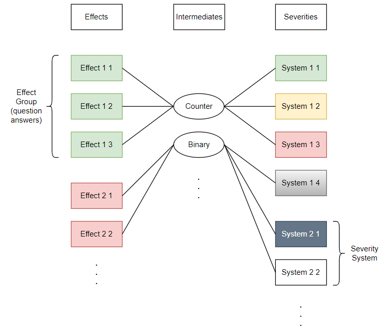

# security-incident-classifier-web-system

A Dynamic Security Incident Classifier Web System for eventual use by IT services here at the university, with the possibility to configure and present classification engines like the Common Vulnerability Scoring System (CVSS - https://www.first.org/cvss/calculator/3.1), with more emphasis on University assets.

The system is designed in such a way that it can accommodate any combination of questions and answers, and how a specific answer chosen affects an end-severity for which there may be many. The motivation as well as increased reasoning of the following model can be found in the documentation. Questions have an off-screen mapping to Effects, which relate to final Severities displayed to the user at the bottom of the current form. Logic that governs the specific way in which Effects alter severities is controlled via how Effects are intermediately mapped to Severities, as such, they are referred to as Intermediates:

 

## Build Instructions

This project is intended for use within the St. Andrews University domain, as such, it can only be deployed amongst St. Andrews
University subnets. Firstly, determine the IP address of the computer or server from which the service will be deployed (with ifconfig
or the like) and run the following command from within the top level directory of this project, make note of the port from which the
service claims to run (it will most likely be 8080 - this will appear after the IP address, delimited by colon (:)):

$ npm run serve

Once again ensuring that the machine you intend on connecting with and the machine from which the service is being run from is
within the St. Andrews University domain, navigate to the IP address and port combination from a web browser of your choosing
